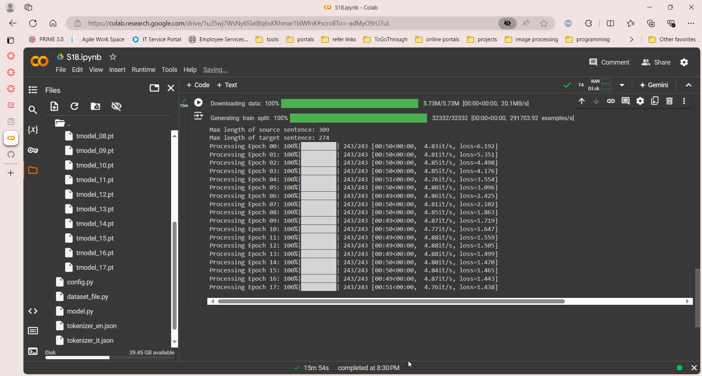

# Assignment 18

## Problem Statement

To modify the transformer model in such a way that it gets loss value under 1.8 within 18 epochs. The transformer model is english to italian translator. And the dataset is from opus_books

This repo contains related files

        config_file.py
        dataset.py
        model.py
        train.py
        s18.ipynb

- Used One cycle policy to find the LR
- Used Automatic Mixed Precision (AMP) while training. documentation: https://pytorch.org/docs/stable/amp.html

## Results

THe code is trained in colab for 18 epochs. The training file is **S18.ipynb**
Below are the training screenshots and the loss reached **1.43** in 18th epoch

